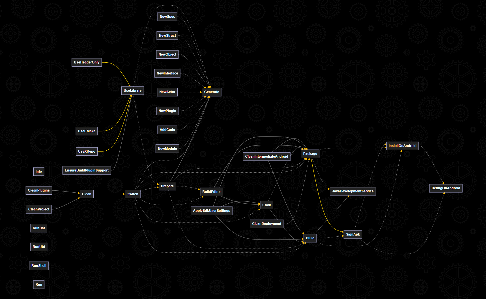

<div align="center">


# Nuke.Unreal

</div>

Simplistic workflow for automating Unreal Engine project tasks embracing [Nuke](https://nuke.build), providing a consistent way to use UE4/5 tools and reducing chores they come with.

- [Nuke.Unreal](#nukeunreal)
- [Usage](#usage)
  - [Install via remote script](#install-via-remote-script)
  - [Install manually](#install-manually)
- [Features:](#features)
- [Setting up for a project](#setting-up-for-a-project)
- [Setting up for plugin development](#setting-up-for-plugin-development)
- [Passing command line arguments to Unreal tools](#passing-command-line-arguments-to-unreal-tools)
  - [Custom UBT or UAT arguments](#custom-ubt-or-uat-arguments)
- [Generators](#generators)
  - [C# code generators for Unreal tools](#c-code-generators-for-unreal-tools)
  - [Using third-party C++ libraries](#using-third-party-c-libraries)
    - [Use library from xrepo](#use-library-from-xrepo)
    - [Use library via CMake](#use-library-via-cmake)
    - [Use header only library](#use-header-only-library)
  - [Unreal boilerplate templates](#unreal-boilerplate-templates)
    - [Use your own templates](#use-your-own-templates)
  - [Semi-auto Runtime Dependencies](#semi-auto-runtime-dependencies)
- [Targets](#targets)
  - [Global targets (UnrealBuild)](#global-targets-unrealbuild)
    - [info](#info)
    - [switch](#switch)
    - [prepare](#prepare)
    - [generate](#generate)
    - [build-editor](#build-editor)
    - [build](#build)
    - [cook](#cook)
    - [clean](#clean)
    - [run](#run)
    - [run-uat](#run-uat)
    - [run-ubt](#run-ubt)
    - [run-shell](#run-shell)
    - [run-editor-cmd](#run-editor-cmd)
    - [ensure-build-plugin-support](#ensure-build-plugin-support)
  - [UnrealBuild.Templating](#unrealbuildtemplating)
  - [Packaging (IPackageTargets)](#packaging-ipackagetargets)
    - [package](#package)
  - [Targeting Android (IAndroidTargets)](#targeting-android-iandroidtargets)
    - [apply-sdk-user-settings](#apply-sdk-user-settings)
    - [clean-intermediate-android](#clean-intermediate-android)
    - [sign-apk](#sign-apk)
    - [install-on-android](#install-on-android)
    - [debug-on-android](#debug-on-android)
    - [java-development-service](#java-development-service)
- [Articles](#articles)


# Usage

> [!WARNING]
> `dotnet` is required to be installed first.

## Install via remote script

Navigate to your project with powershell and do

```
Set-ExecutionPolicy Unrestricted -Scope Process -Force; iex (iwr 'https://raw.githubusercontent.com/microdee/Nuke.Unreal/refs/heads/main/install/install.ps1').ToString()
```

## Install manually

Nuke.Unreal is available as a Nuget package and you can just add it to your build project as usual (package ID is `md.Nuke.Unreal`)

1. <details><summary>Install Nuke for an Unreal project</summary>  
   
   ```
   > dotnet tool install Nuke.GlobalTool --global
   
   > nuke :setup
     select None for solution
     build project inside Nuke.Targets folder
   
   > nuke :add-package md.Nuke.Unreal
   ```
   
   </details>
2. Inherit your Build class from `UnrealBuild` instead of `NukeBuild` and make it `public`
3. Use `Main () => Plugins.Execute<Build>(Execute);` instead of `Main () => Execute();`
4. No further boilerplate required, run `nuke --plan` to test Nuke.Unreal
5. ***(optional)*** Inherit `IPackageTargets` interface if you want to package the associated Unreal project

Your bare-bones minimal Build.cs which will provide the default features of Nuke.Unreal should look like this:

```CSharp
// Build.cs
using Nuke.Common;
using Nuke.Unreal;
using Nuke.Cola.BuildPlugins;

public class Build : UnrealBuild
{
    public static int Main () => Plugins.Execute<Build>(Execute);
}
```

# Features:

* All what the great Nuke can offer
* Common Unreal build tasks (generate project files, build editor, cook, package, etc)
  ```
  > nuke generate
  > nuke build-editor
  > nuke cook
  > nuke package
  > nuke build --config Shipping
  > nuke build --config DebugGame Development --target-type Game --platform Android
  ```
* Unreal engine location is automatically determined (on Windows at least)
* Execute Unreal tools without the need to navigate to their location
  ```
  > nuke run-uat --> <args...>
  > nuke run-ubt --> <args...>
  > nuke run-shell
  > nuke run --tool editor-cmd --> <args...>
  ```
* Install C++ libraries (using [xrepo](https://xrepo.xmake.io))
  ```
  > nuke use-xrepo --spec "imgui 1.91.1 freetype=true" "vcpkg::ryml[dbg]" "conan::zlib/1.2.11"
  > nuke generate
  ```
* Generate boilerplate code and scaffolding from [Scriban](https://github.com/scriban/scriban) templates so no editor needs to be opened
    ```
    > nuke new-actor --name MyActor
    > nuke new-plugin --name MyPlugin
    > nuke new-module --name MyModule
    > nuke use-cmake --spec MyLibrary
    etc...
    ```
* Generated C# configurators for Unreal tools with gathered documentation. (UBT and UAT)
* Pluggable way to define targets for reusable plugins and modules
* Prepare Unreal Plugins for distribution with easy to use API.

# Setting up for a project

Nuke.Unreal targets looks for the `*.uproject` file automatically and it will use the first one it finds. A `*.uproject` is required to be present even for plugin development (more on plugins below). Automatically found project files can be in the sub-folder tree of Nuke's root (which is the folder containing the `.nuke` temporary folder) or in parent folders of Nuke's root. If for any reason there are more than one or no `*.uproject` files in that area, the developer can specify an explicit location of the associated `*.uproject` file.

```CSharp
public override AbsolutePath ProjectPath => RootDirectory / ".." / "MyProject" / "MyProject.uproject";
```

Only one Unreal project is supported per Nuke.Unreal instance.

# Setting up for plugin development

A little bit of theory: Unreal plugins are simple on the surface but easily can get very complicated to handle especially when they need to interact with the non-unreal world. For this reason it is recommended to break up development and distribution of Unreal plugins into multiple stages:

<div align="center">


</div>

Nuke.Unreal lives in the "**True Plugin Source**" stage *(whatever that may look like in your software architecture)* and helps to deliver it to further distribution stages.

Plugins can be managed by creating your own targets to handle them. You can do that inside either your main build class, or glue that logic to your Unreal plugin in its folder structure via [Nuke.Cola build plugins](https://github.com/microdee/md.Nuke.Cola?tab=readme-ov-file#build-plugins). The simplest method of which is [standalone `*.nuke.cs` files](https://github.com/microdee/md.Nuke.Cola?tab=readme-ov-file#implicitbuildinterface-plugins) which are compiled with the build project.

Let's have this scaffolding as an example:

```
<project root>
│   MyUnrealProject.uproject
├── .nuke
├── Content, Build, etc...
├── Nuke.Targets
│       Build.cs
│       Nuke.Targets.csproj (main build script)
└── Plugins
    └── MyPlugin
        │   MyPlugin.nuke.cs
        ├── Source
        │   └── MyModule
        │       │   MyModule.nuke.cs
        │       └── <source files>
        └── <regular plugin files>
```

Build interfaces (or in Nuke vocabulary "[Build Components](https://nuke.build/docs/sharing/build-components/)") decorated with `[ImplicitBuildInterface]` inside these `*.nuke.cs` files will automatically contribute to the build graph without further boilerplate.

```CSharp

// MyModule.nuke.cs
using Nuke.Common;
using Nuke.Cola;
using Nuke.Cola.BuildPlugins;
using Nuke.Unreal;

namespace Nuke.MyModule;

[ImplicitBuildInterface]
public interface IMyModuleTargets : INukeBuild
{
    Target PrepareMyModule => _ => _
        .Executes(() =>
        {
            var self = (UnrealBuild)this;

            // This will automatically fetch the plugin which owns this particular script.
            // These plugin objects are shared among all targets and they can all manipulate their aspects
            var thisPlugin = UnrealPlugin.Get(this.ScriptFolder());

            // This module has some runtime dependencies which it needs to sort out
            // This function gets the plugin in itself, no need to use thisPlugin here
            // See exact usage of this in section "Semi-auto Runtime Dependencies"
            self.PrepareRuntimeDependencies(this.ScriptFolder(), /* ... */);
        });
}

// MyPlugin.nuke.cs
using Nuke.Common;
using Nuke.Cola;
using Nuke.Cola.BuildPlugins;
using Nuke.Unreal;
namespace Nuke.MyPlugin;

[ImplicitBuildInterface]
public interface IMyPluginTargets : INukeBuild
{
    Target PrepareMyPlugin => _ => _
        .DependentFor<UnrealBuild>(u => u.Prepare)
        .DependsOn<IMyModuleTargets>()
        .Executes(() =>
        {
            // This will automatically fetch the plugin which owns this particular script.
            // These plugin objects are shared among all targets and they can all manipulate their aspects
            var thisPlugin = UnrealPlugin.Get(this.ScriptFolder());

            // Do extra logic scoped for the plugin...
        });
    
    Target DistributeMyPlugin => _ => _
        .DependsOn(PrepareMyPlugin)
        .Executes(() =>
        {
            // Create a copy of this plugin which can be distributed to other developers or other tools
            // who shouldn't require extra non-unreal related steps to work with it.
            // You can upload the result of this to Fab.
            var (files, outputDir) = UnrealPlugin.Get(this.ScriptFolder()).DistributeSource();

            // Do something with the affected files or in the output directory...
        });
    
    Target BuildMyPlugin => _ => _
        .DependsOn(PrepareMyPlugin)
        .Executes(() =>
        {
            // Build this plugin with UAT for binary distribution
            var outputDir = UnrealPlugin.Get(this.ScriptFolder()).BuildPlugin();

            // Do something in the output directory...
        });
}
```

And call them later with

```
> nuke prepare-my-plugin
> nuke distribute-my-plugin
> nuke build-my-plugin
```

You have absolute freedom to organize the task-dependency graph around handling your plugins. For example one target may manipulate multiple plugins even, from a dynamic set of folders. The above example is just a simple use-case.

# Passing command line arguments to Unreal tools

In some targets Nuke.Unreal allows to pass custom command line arguments for Unreal tools. This is only necessary for advanced use cases, and for prototyping. In almost all cases once a workflow is developed with these custom arguments it is recommended to solidify them into a custom target, or use the plathera of customization and modularization points Nuke.Unreal offers.

Command line arguments are passed with the `-->` sequence, anything after such sequence will be passed directly to tools. This is dubbed as "argument blocks". The precise usage of them depends on the specific target being used. Multiple argument blocks can be named and used by targets. A block ends when another one starts or when it's the end of the command line input.

In all cases Nuke.Unreal provides some variables so the user don't need to repeat long paths. These variables are replaced at any position of the text of any argument. These variables are:

```
   ~p - Absolute path of the .uproject file
~pdir - Absolute folder containing the .uproject file
  ~ue - Absolute path to the engine root
```

For example

```
> nuke run --tool editor-cmd --> ~p -run=MyCommandlet
UnrealEditor-Cmd.exe C:\Projects\Personal\MyProject\MyProject.uproject -run=MyCommandlet
```

## Custom UBT or UAT arguments

When invoking common tasks Nuke.Unreal supports passing extra custom arguments to UBT or UAT via `-->ubt` or `-->uat`. Anything passed behind these or in-between these will be passed to their respective tool.

This is especially useful for doing temporary debugging with UBT and the compiler: (not an actual usecase)
```
> nuke build ... -->ubt -CompilerArguments="/diagnostics:caret /P /C" -DisableUnity
> nuke build ... -->ubt -LinkerArguments=/VERBOSE
> nuke build ... -->ubt -Preprocess
```

# Generators

## C# code generators for Unreal tools

Nuke.Unreal provides builder pattern Unreal tool configurators in C# which yield a command line for the specified tool. TLDR: the syntax looks like this:

```CSharp
// For UBT:
Unreal.BuildTool(this, _ => _
    .Target(UnrealTargetType.Server)
    .Platform(UnrealPlatform.LinuxArm64)
    .Configuration(UnrealConfig.Development)
    .Project(ProjectPath)
    .Append(MyExplicitArguments)
)(workingDirectory: MyEnginePath);

// For UAT:
Unreal.AutomationTool(this, _ => _
    .BuildPlugin(_ => _
        .Plugin(PluginPath)
        .Package(targetDir)
        .StrictIncludes()
        .Unversioned()
    )
    .Append(self.UatArgs.AsArguments())
)(workingDirectory: MyEnginePath);
```

As the reader can see from the GIF this introduces a greater discoveribility to the vast functionality of both UAT and UBT which simply was not there before unless the developer followed some trails inside the source code of these tools. In fact the UAT configurator is generated from the actual source code using static code analysis and relying on semantical heuristics as the command line interpretation of UAT is very organic and inconsistent to say the least.

UBT on the other hand had a more disciplined and consistent approach for interpreting the command line, that allowed to rely on purely reflection while gathering arguments with the added feature of typed parameter value input (like numbers, strings and enums). As of time of writing detecting parameter types in a reliable and meaningful way is not possible for UAT.

## Using third-party C++ libraries

Nuke.Unreal allows you to set up boilerplate for C++ libraries, or fetch them via a package manager. In all cases the artifacts it generates are placed in the working directory (the current location of your terminal). In all cases they're managed in their own preparation targets which are generated for you.

There are three methods available:

### Use library from [xrepo](https://xrepo.xmake.io)

Tt can be as simple as

```
> nuke use-xrepo --spec "zlib"
```

or fully specified with version and library options

```
> nuke use-xrepo --spec "imgui 1.91.1 freetype=true,dx11=true,dx12=true,vulkan=true"
```

and multiple libraries can be set up in one go

```
nuke use-xrepo --spec "imgui 1.91.1 freetype=true" "conan::zlib/1.2.11" "vcpkg::spdlog[wchar]" <etc...>
```

As you can see xrepo also can act like a meta-package-manager for libraries which may not yet been added to the xrepo repository. However their support is more limited than xrepo "native" packages.

`use-xrepo` will not fetch the specified libraries immediately but rather generate build plugins for them, which define `Prepare-<library>` targets. These are all dependent for `Prepare` target of `UnrealBuild` which is then dependent for `Generate`. So after `nuke use-xrepo` running `nuke prepare` or `nuke generate` will fetch and install properly all libraries used in this way. Having an extra build plugin allows the developer to further customize how the library is used, or add extra necessary operations.

`--spec` follows this syntax:

```
provider::name[comma,separated,features] 1.2.3 comma='separated',options=true
```

> [!NOTE]
> Conan packages use `/` to delimit version (`conan::zlib/1.2.3`) instead of space. VCPKG through xrepo cannot set specific version so attempting to do `vcpkg::zlib 1.2.3` will result in failing installation, but `vcpkg::zlib` is fine.

> [!NOTE]
> Since Unreal requires `MD` C runtime linkage `runtimes='MD'` is implicitly added by Nuke.Unreal.

The `Prepare` and the individual `Prepare-<library>` targets will generate partial module rule classes for the platforms they were invoked for. This is done because libraries may have different requirements based on which platform they're used on / compiled on. The main `MyLibrary.Build.cs` module rule is the place for the developer to add custom logic if that's necessary for the library. Individual `MyLibrary.Platform.Build.cs` partial rules set up includes and libs.

> [!IMPORTANT]
> During installation only one platform is considered, and only one platform worth of module rule class will be generated. This means the library should be prepared with all supported platforms or cross-compiled to be able to deploy in a truly cross-platform fashion.

The main benefit of this design is that libraries prepared this way can be further distributed with source but without the need for Nuke.Unreal, or without the need to execute complex behavior from the module rule files. This ensures for example ~~Marketplace~~/Fab compliance of plugins.

### Use library via CMake

```
nuke use-cmake --spec MyLibrary
```

This generates build plugins allowing the developer to prepare libraries via CMake. Fetching and storing the library is the responsibility of the developer. The build plugin is prepared for the most trivial use case when compiling a library via CMake but one may need to modify that depending on the design decisions of the library being used.

### Use header only library

```
nuke use-header-only --spec MyLibrary
```

This will directly generate only the module rule file without the need for extra preparations like with the xrepo or the CMake methods.

## Unreal boilerplate templates

Nuke.Unreal provides some targets which creates boilerplate code for common Unreal entities, such as

* Plugins
* Modules
* Unreal Object/Actor/Structs/Interfaces

without the need for opening the Unreal editor or extend heavy weight IDE's. These boilerplate targets work with Scriban templates. The path to these templates can be overridden in the actual Nuke build class in case a project requires further boilerplate. Example:

In any folder in your project do

```
> nuke new-actor --name MyPreciousActor
```

This will generate MyPreciousActor.h and ~.cpp at their respective places (taking public and private folders into account) and the minimal actor class boilerplate for unreal.

### Use your own templates

Optional **Custom templates** folders are required to contain generator specific subfolders. If a subfolder doesn't exist for a generator the default will be used. Example:

Given directory scaffolding:

```
<project root>
├── ...
├── MyTemplates
│   ├── Actor
│   └── Object
└── Nuke.Targets
        Build.cs
        ...
```

In `Nuke.Targets/Build.cs` override `TemplatesPath` property
```CSharp
public override AbsolutePath TemplatesPath { get; set; } = RootDirectory / "MyTemplates";
```

This way Actor and Object generators will have their project specific Scriban templates but the remaining generator types will use the default templates of Nuke.Unreal.

## Semi-auto Runtime Dependencies

Some third-party libraries or solutions may come with a lot of binary dependencies, which needs to be organized neatly into specific folders when distributing the project. Module rules provide a mechanism for managing arbitrary runtime dependencies, and UAT will distribute them when packaging. However when there's a lot of files in elaborate folder structure it is quite a chore to list them all in module rules.

Nuke.Unreal comes with a feature dubbed "Auto Runtime Dependencies" which can generate partial module rules sorting them out for each platform and configuration. This is only meant to be used for large, prebuilt libraries ususally downloaded or pre-installed for a project. Libraries fetched in other ways like the XRepo workflow, doesn't need this feature, as the same problem is solved there in a different way.

Here's the overview of the usage of `PrepareRuntimeDependencies` function:

1. Provide a source folder for the runtime dependencies
2. Provide a set of locations in runtime, relative to the destination folder serving as runtime library paths (ideally one for each supported platforms). This may be used as base folders to load DLL's from.
3. If applicable provide pattern matching functions to determine the platform and configuration for individual files
4. To control the destination folder structure `PrepareRuntimeDependencies` may pick up a folder composition manifest file called "RuntimeDeps.yml" (by default this can be also overridden)
5. If no such manifest is available one can be passed directly in C#

The module rule will copy output files on building the project to `<plugin-directory>/Binaries/<binariesSubfolder>/<moduleName>`. Where `binariesSubfolder` is "ThirdParty" by default.

For example have the following file structure of a module representing a third-party library:

```
TpModule
├── ...
├── LibraryFiles
│   ├── includes ...
│   └── lib
│       ├── win_amd64
│       │   ├── rel
│       │   │   ├── libtp.lib
│       │   │   └── *.dll
│       │   └── debug
│       │       ├── libtp.lib
│       │       └── *.dll
│       └── linux_x86_64
│           ├── rel
│           │   ├── libtp.lib
│           │   └── *.so
│           └── debug
│               ├── libtp.lib
│               └── *.so
├── RuntimeDeps.yml
├── TpModule.Build.cs
└── TpModule.nuke.cs
```

```yaml
# RuntimeDeps.yml
copy:
  - file: LibraryFiles/win_amd64/rel/*.dll
    as: Win64/Release/$1.dll
  - file: LibraryFiles/win_amd64/debug/*.dll
    as: Win64/Debug/$1.dll
  - file: LibraryFiles/linux_x86_64/rel/*.so
    as: Linux/Release/$1.so
  - file: LibraryFiles/linux_x86_64/debug/*.so
    as: Linux/Debug/$1.so
```

```CSharp
// TpModule.Build.cs

using System;
using UnrealBuildTool;

public partial class TpModule : ModuleRules
{
    public TpModule(ReadOnlyTargetRules target) : base(target)
    {
		Type = ModuleType.External;
        SetupRuntimeDependencies(target);
    }
    partial void SetupRuntimeDependencies(ReadOnlyTargetRules target);
}
```

```CSharp
// TpModule.nuke.cs

using Nuke.Common;
using Nuke.Cola;
using Nuke.Cola.BuildPlugins;
using Nuke.Unreal;

[ImplicitBuildInterface]
public interface IMyPluginTargets : INukeBuild
{
    Target PrepareMyPlugin => _ => _
        .Executes(() =>
        {
            this.PrepareRuntimeDependencies(
                this.ScriptFolder(),
                [
                    new() {
                        Path = (RelativePath)"Win64/Release",
                        Config = RuntimeDependencyConfig.Release,
                        Platform = UnrealPlatform.Win64
                    },
                    new() {
                        Path = (RelativePath)"Win64/Debug",
                        Config = RuntimeDependencyConfig.Debug,
                        Platform = UnrealPlatform.Win64
                    },
                    new() {
                        Path = (RelativePath)"Linux/Release",
                        Config = RuntimeDependencyConfig.Release,
                        Platform = UnrealPlatform.Linux
                    },
                    new() {
                        Path = (RelativePath)"Linux/Debug",
                        Config = RuntimeDependencyConfig.Debug,
                        Platform = UnrealPlatform.Linux
                    },
                ],
                determineConfig: f =>
                    f.ToString().Contains("rel")
                    ? RuntimeDependencyConfig.Release
                    : f.ToString().Contains("debug")
                    ? RuntimeDependencyConfig.Debug
                    : RuntimeDependencyConfig.All
                ,
                determinePlatform: f =>
                    f.ToString().Contains("win_amd64")
                    ? UnrealPlatform.Win64
                    : f.ToString().Contains("linux_x86_64")
                    ? UnrealPlatform.Linux
                    : UnrealPlatform.Independent
            );
        });
}
```

<details>
<summary>Will generate a partial module rule file:</summary>

```CSharp

// TpModule.Rtd.Build.cs
// This is an automatically generated file, do not modify

using System;
using UnrealBuildTool;

public partial class TpModule : ModuleRules
{
	void HandleRuntimeLibraryPath(string path)
	{
		PublicRuntimeLibraryPaths.Add($"{PluginDirectory}/{path}");
		PublicDefinitions.Add($"TPMODULE_DLL_PATH=TEXT(\"{path}\")");
	}

	void HandleRuntimeDependency(string from, string to) =>
		RuntimeDependencies.Add(
			$"{PluginDirectory}/{from}", $"{PluginDirectory}/{to}",
			StagedFileType.SystemNonUFS
		);

	partial void SetupRuntimeDependencies(ReadOnlyTargetRules target)
	{
		var Win64 =       target.Platform == UnrealTargetPlatform.Win64;
		var Mac =         target.Platform == UnrealTargetPlatform.Mac;
		var Linux =       target.Platform == UnrealTargetPlatform.Linux;
		var LinuxArm64 =  target.Platform == UnrealTargetPlatform.LinuxArm64;
		var Android =     target.Platform == UnrealTargetPlatform.Android;
		var IOS =         target.Platform == UnrealTargetPlatform.IOS;
		var TVOS =        target.Platform == UnrealTargetPlatform.TVOS;
		var VisionOS =    target.Platform == UnrealTargetPlatform.VisionOS;
		var Independent = true;

		var Debug = target is
		{
			Configuration: UnrealTargetConfiguration.Debug,
			bDebugBuildsActuallyUseDebugCRT: true
		};
		var Release = !Debug;
		var All = true;

		if (Release && Win64) HandleRuntimeLibraryPath("Binaries/ThirdParty/TpModule/Win64/Release");
		if (Debug && Win64) HandleRuntimeLibraryPath("Binaries/ThirdParty/TpModule/Win64/Debug");
		if (Release && Linux) HandleRuntimeLibraryPath("Binaries/ThirdParty/TpModule/Linux/Release");
		if (Debug && Linux) HandleRuntimeLibraryPath("Binaries/ThirdParty/TpModule/Linux/Debug");

		if (Release && Win64) HandleRuntimeDependency("Source/ThirdParty/TpModule/LibraryFiles/lib/win_amd64/rel/foo.dll", "Binaries/ThirdParty/TpModule/Win64/Release/foo.dll");
		if (Release && Win64) HandleRuntimeDependency("Source/ThirdParty/TpModule/LibraryFiles/lib/win_amd64/rel/bar.dll", "Binaries/ThirdParty/TpModule/Win64/Release/bar.dll");
		if (Release && Win64) HandleRuntimeDependency("Source/ThirdParty/TpModule/LibraryFiles/lib/win_amd64/rel/etc.dll", "Binaries/ThirdParty/TpModule/Win64/Release/etc.dll");
		if (Debug && Win64) HandleRuntimeDependency("Source/ThirdParty/TpModule/LibraryFiles/lib/win_amd64/debug/foo.dll", "Binaries/ThirdParty/TpModule/Win64/Debug/foo.dll");
		if (Debug && Win64) HandleRuntimeDependency("Source/ThirdParty/TpModule/LibraryFiles/lib/win_amd64/debug/bar.dll", "Binaries/ThirdParty/TpModule/Win64/Debug/bar.dll");
		if (Debug && Win64) HandleRuntimeDependency("Source/ThirdParty/TpModule/LibraryFiles/lib/win_amd64/debug/etc.dll", "Binaries/ThirdParty/TpModule/Win64/Debug/etc.dll");
		if (Release && Linux) HandleRuntimeDependency("Source/ThirdParty/TpModule/LibraryFiles/lib/linux_x86_64/rel/foo.so", "Binaries/ThirdParty/TpModule/Linux/Release/foo.so");
		if (Release && Linux) HandleRuntimeDependency("Source/ThirdParty/TpModule/LibraryFiles/lib/linux_x86_64/rel/bar.so", "Binaries/ThirdParty/TpModule/Linux/Release/bar.so");
		if (Release && Linux) HandleRuntimeDependency("Source/ThirdParty/TpModule/LibraryFiles/lib/linux_x86_64/rel/etc.so", "Binaries/ThirdParty/TpModule/Linux/Release/etc.so");
		if (Debug && Linux) HandleRuntimeDependency("Source/ThirdParty/TpModule/LibraryFiles/lib/linux_x86_64/debug/foo.so", "Binaries/ThirdParty/TpModule/Linux/Debug/foo.so");
		if (Debug && Linux) HandleRuntimeDependency("Source/ThirdParty/TpModule/LibraryFiles/lib/linux_x86_64/debug/bar.so", "Binaries/ThirdParty/TpModule/Linux/Debug/bar.so");
		if (Debug && Linux) HandleRuntimeDependency("Source/ThirdParty/TpModule/LibraryFiles/lib/linux_x86_64/debug/etc.so", "Binaries/ThirdParty/TpModule/Linux/Debug/etc.so");

		if (Release && Win64) PublicDelayLoadDLLs.Add("foo.dll");
		if (Release && Win64) PublicDelayLoadDLLs.Add("bar.dll");
		if (Release && Win64) PublicDelayLoadDLLs.Add("etc.dll");
		if (Debug && Win64) PublicDelayLoadDLLs.Add("foo.dll");
		if (Debug && Win64) PublicDelayLoadDLLs.Add("bar.dll");
		if (Debug && Win64) PublicDelayLoadDLLs.Add("etc.dll");
		if (Release && Linux) PublicDelayLoadDLLs.Add("foo.so");
		if (Release && Linux) PublicDelayLoadDLLs.Add("bar.so");
		if (Release && Linux) PublicDelayLoadDLLs.Add("etc.so");
		if (Debug && Linux) PublicDelayLoadDLLs.Add("foo.so");
		if (Debug && Linux) PublicDelayLoadDLLs.Add("bar.so");
		if (Debug && Linux) PublicDelayLoadDLLs.Add("etc.so");
		
		var dllList = string.Join(',', PublicDelayLoadDLLs.Select(d => $"TEXT(\"{d}\")"));
		PublicDefinitions.Add($"TPMODULE_DLL_FILES={dllList}");
	}
}
```

</details>

This is of course a toy example. As you can see though this may end up with quite a lot of boilerplate code, so again this is only recommended for libraries which needs a non-trivial folder structure of files and DLL's for its runtime.

# Targets

In Nuke (and consequently in Nuke.Unreal) a target is a delegate which can build a dependency execution graph with other targets. Nuke's main selling point is how these targets allow complex build compositions and how that can be controlled via command line or profile files.



Nuke.Unreal provides couple of universally useful targets associated with regular chores regarding Unreal Engine development. The above figure shows all convenience targets available and their relationship to each other. This also includes optional targets (coming from `IPackageTargets`, `IPluginTargets` and `IAndroidTargets`)

> [!NOTE]
> All parameters specified here are optional and have a "sensible" default, unless they're marked required.

## Global targets (UnrealBuild)

They're available for all project types just from using `UnrealBuild` as base class (`UnrealBuild.Targets.cs` or `UnrealBuild.Templating.cs`).

### info

Prints curated information about project.

### switch

Switch to the specified Unreal Engine version and platform. A CI/CD can call nuke with this target multiple times to deploy plugins for multiple engine versions for example.

* Parameters:
  * `--unreal` **REQUIRED**
    * Can be simple version name like `5.5`, a GUID associated with engine location or an absolute path to engine root.
* Graph:
  * Depends on [`clean`](#clean)
  * Before [prepare](#prepare)
  * Before [generate](#generate)
  * Before [buildEditor](#build-editor)
  * Before [build](#build)
  * Before [cook](#cook)

### prepare

Run necessary preparations which needs to be done before Unreal tools can handle the project. By default it is empty and the main build project may override it or other Targets can depend on it / hook into it. For example the generated Nuke targets made by `use-cmake` or `use-xrepo` are dependent for `prepare`

### generate

Generate project files for the default IDE of the current platform (i.e.: Visual Studio or XCode). It is equivalent to right clicking the uproject and selecting "Generate _IDE_ project files".

* Graph:
  * Depends on [`prepare`](#prepare)
* Plans:
  * [ ] TODO: Provide more arguments for how the project is generated

### build-editor

Shorthand for building the editor for current platform.

* Parameters:
  * `--editor-config` default is `developnment`
* Graph:
  * After [`prepare`](#prepare)

### build

Uses UBT to build one of the main project targets (Game, Editor, Client, Server).

* Parameters:
  * `--config` default is `development`
  * `--target-type` default is `game`
  * `--platform` default is current development platform
* Argument blocks:
  * `-->ubt` see [Custom UBT or UAT arguments](#custom-ubt-or-uat-arguments)
* Graph:
  * After [`cook`](#cook)
  * After [`prepare`](#prepare)

### cook

Cook Unreal assets for standalone game execution with UAT.

* Parameters:
  * `--config` default is `development`
  * `--platform` default is current development platform
  * from [`IAndroidTargets`](#targeting-android-iandroidtargets)
    * `--android-texture-mode` default is `multi`
* Argument blocks:
  * `-->uat` see [Custom UBT or UAT arguments](#custom-ubt-or-uat-arguments)
* Graph:
  * Depends on [`build-editor`](#build-editor)

### clean

Removes auto generated folders of Unreal Engine

* Graph:
  * Depends on:
    * `clean-project`
    * `clean-plugins`
  * Related to `clean-deployment`
* Plans:
  * [ ] TODO: it may be too aggressive, use rather UAT?

### run

Run an Unreal tool from the engine binaries folder. You can omit the `Unreal` prefix and the extension. For example:

```
> nuke run --tool pak --> ./Path/To/MyProject.pak -Extract "D:/temp"
> nuke run --tool editor-cmd --> ~p -run=MyCommandlet
```

Working directory is the project folder, regardless of actual working directory.

* Parameters:
  * `--tool`
* Argument blocks:
  * `-->` see [Passing command line arguments to Unreal tools](#passing-command-line-arguments-to-unreal-tools)

### run-uat

Simply run UAT with arguments passed after `-->`

* Parameters:
  * `--ignore-global-args`
* Argument blocks:
  * `-->` see [Passing command line arguments to Unreal tools](#passing-command-line-arguments-to-unreal-tools)

### run-ubt

Simply run UBT with arguments passed after `-->`

* Parameters:
  * `--ignore-global-args`
* Argument blocks:
  * `-->` see [Passing command line arguments to Unreal tools](#passing-command-line-arguments-to-unreal-tools)

### run-shell

Create console window with a [UShell](https://dev.epicgames.com/documentation/en-us/unreal-engine/how-to-use-ushell-for-unreal-engine) session. Only fully supported after UE 5.5

### run-editor-cmd

Run an editor commandlet with arguments passed in after `-->`

* Parameters:
  * `--cmd`
* Argument blocks:
  * `-->` see [Passing command line arguments to Unreal tools](#passing-command-line-arguments-to-unreal-tools)

### ensure-build-plugin-support

Ensure support for plain C# build plugins without the need for CSX or dotnet projects. This only needs to be done once and you can check the results into source control. It will modify the main Nuke project itself, see [Setting up for plugin development](#setting-up-for-plugin-development) or [`[ImplicitBuildInterface]` plugins of Nuke.Cola](https://github.com/microdee/md.Nuke.Cola?tab=readme-ov-file#implicitbuildinterface-plugins)

If you used the [remote script install method](#install-via-remote-script) then you don't need to run this target as it's already configured for you.

## UnrealBuild.Templating

These targets are used as a development aid for generating boilerplates. See [Using third-party C++ libraries](#using-third-party-c-libraries) and [Unreal boilerplate templates](#unreal-boilerplate-templates) for full explanation. Because those sections explain in detail how to use boilerplate generator targets, they will be only listed here:

```
new-module      --name ...
add-code        --name ...
new-plugin      --name ...
new-actor       --name ...
new-interface   --name ...
new-object      --name ...
new-struct      --name ...
new-spec        --name ...
use-library     --spec ... --library-type ...
use-xrepo       --spec ...
use-cmake       --spec ...
use-header-only --spec ...
```

Only special mention is `use-library` which is not recommended to be used manually, use either one of `use-xrepo`, `use-cmake` or `use-header-only`. `use-library` expects an extra `--library-type` which the former targets already fill in.

## Packaging (IPackageTargets)

### package

Package the project for distribution. Same as packaging the project from the editor.

* Parameters:
  * `--config` default is `development`
  * `--editor-config` default is `development`
  * `--platform` default is current development platform
  * `--output` default is `<project root>/Intermediate/Output`(#custom-ubt-or-uat-arguments)
  * from [`IAndroidTargets`](#targeting-android-iandroidtargets)
    * `--android-texture-mode` default is `multi`
* Argument blocks:
  * `-->uat` see [Custom UBT or UAT arguments](#custom-ubt-or-uat-arguments)
* Graph:
  * Depends on [`build-editor`](#build-editor)
  * After
    * `clean-deployment`
    * [`cook`](#cook)
    * [`prepare`](#prepare)

## Targeting Android (IAndroidTargets)

* Plans
  * [ ] TODO: Android targets require some tidy-up and "nicer" interaction with SDK managers (both from the Android SDK Manager and Epic's AutoSDK). Some of the targets are still experimental and probably won't lose that status in the forseeable future

### apply-sdk-user-settings

Epic in their infinite wisdom decided to store crucial project breaking build settings in a user scoped shared location (AppData/Local on Windows). This target attempts to make it less shared info, so one project compilation doesn't break the other one if they use different Engine versions and if these settings are not solidified in `*Engine.ini`.

* Parameters:
  * the default for all of these are determined from engine version and the current user configuration. SDK and NDK versions and API levels can be simple numbers.
  * `--android-build-tool-version`
  * `--android-sdk-path`
  * `--android-ndk-version`
  * `--android-java-path`
  * `--adnroid-sdk-api-level`
  * `--adnroid-ndk-api-level`
* Graph:
  * Dependent for
    * [`build`](#build)
    * [`cook`](#cook)
    * from [`IPackageTargets`](#packaging-ipackagetargets)
      * [`package`](#package)

### clean-intermediate-android

During Android development workflows involving debugging Unreal programs with the generated Gradle project in Android Studio, or developing Java files, Android Studio may modify the generated Gradle project caches in a way that is unexpected for Unreal tools and which may fail in consequent builds. This target clears only the intermediate files generated for Android tooling to avoid such scenario.

This target hooks itself into package and build targets so it's very rare that it has to be executed manually.

* Graph:
  * Dependent for
    * [`build`](#build)
    * from [`IPackageTargets`](#packaging-ipackagetargets)
      * [`package`](#package)

### sign-apk

In some cases UAT or UBT fails to sign the generated APK with the data provided from `[/Script/AndroidRuntimeSettings.AndroidRuntimeSettings]` @ `*Engine.ini`, so this target does that manually directly using the Android tooling.

* Parameters:
  * the default for all of these are determined from engine version and the current user configuration. SDK and NDK versions and API levels can be simple numbers.
  * `--android-build-tool-version`
* Graph:
  * Triggered by [`package`](#package)
  * After [`build`](#build)
  * Before
    * [`install-on-android`](#install-on-android)
    * [`debug-on-android`](#debug-on-android)

### install-on-android

Install the result of packaging or build on a connected android device, same as the "install APK" generated batch files, but more robust. This may provide an alternative to "Launch on device" feature available in Editor but for cases when for some cursed reason that is not supported by the project, or for cases when a bug only happens in distributed or almost distributed builds.

> [!WARNING]
> Assumes ADB is in PATH

* Parameters:
  * the default for all of these are determined from engine version and the current user configuration. SDK and NDK versions and API levels can be simple numbers.
  * `--android-build-tool-version`
* Graph:
  * After
    * [`package`](#package)
    * [`build`](#build)

### debug-on-android

Run this project on a connected Android device from the result of packaging or build with the ActivityManager. This may provide an alternative to "Launch on device" feature available in Editor but for cases when for some cursed reason that is not supported by the project, or for cases when a bug only happens in distributed or almost distributed builds.

> [!WARNING]
> Assumes ADB is in PATH

* Graph:
  * After [`install-on-android`](#install-on-android)

### java-development-service

> [!CAUTION]
> This is highly experimental and only developed for specific cases, but with ambitious intents.

This was an attempt to sync Java files copied into the generated Gradle project back to their original source whenever they're changed. At the moment this is very experimental, may not cover all edge cases, and if I ever return to this problem, I'll rewrite this to use symlinks instead which is set up by another target which needs to be run only once (instead of this acting as a file-system watcher service).

# Articles

* [Nuke.Unreal 2.2](https://mcro.de/c/log/nuke-unreal-2-2)
* [Nuke.Unreal 2.1](https://mcro.de/c/log/nuke-unreal-2-1)
* [Nuke.Unreal 1.2](https://mcro.de/c/log/nuke-unreal-1-2)
